# Deep Ocean UML va UI Flow

Tai lieu nay mo ta cach app Deep Ocean khoi dong, luu du lieu, dieu khien mot
phien focus/dive, va hien thi UI theo tung buoc. Cac diagram dung Mermaid nen co
the render truc tiep trong GitHub hoac VS Code Mermaid Preview.

## 1. Tong Quan Kien Truc

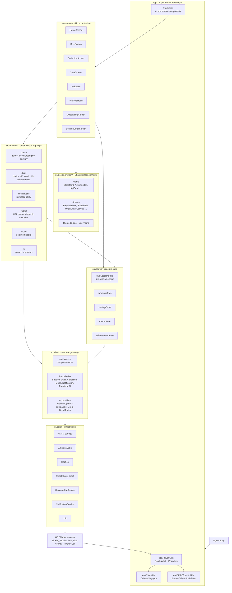

### Nguyen tac phu thuoc

- `app/` chi la route layer, export hoac redirect sang screen.
- `src/screens/` dieu phoi UI, hooks, store actions; khong nen chua business logic nang.
- `src/features/` chua logic testable: depth, zone, discovery, streak, widget policy, AI context.
- `src/stores/` chua state reactive; `diveSessionStore` la live engine quan trong nhat.
- `src/data/container.ts` tap trung wiring repository/gateway.
- `src/domain/` chi co type/interface thuan, khong React, khong IO.

## 2. Router Va Screen Map

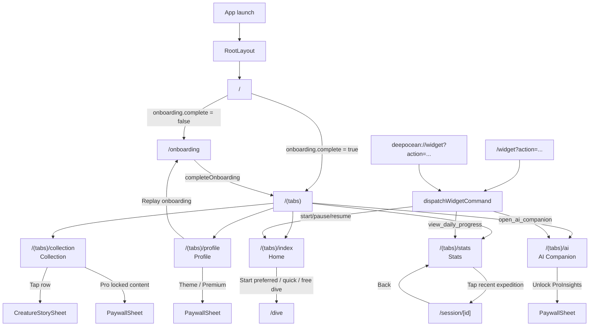

## 3. App Boot Sequence

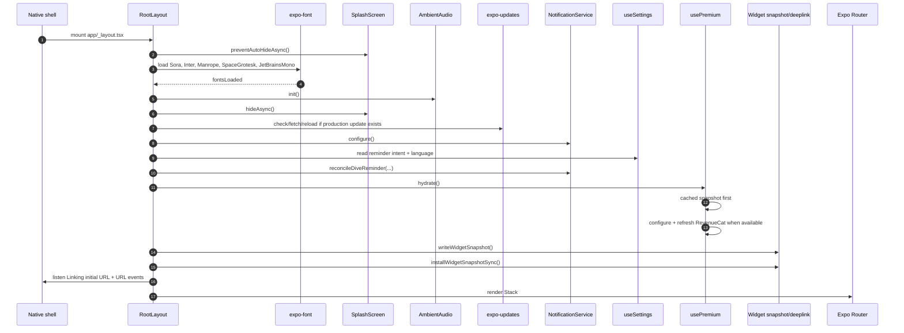

Root providers render around every screen:

```mermaid
flowchart LR
  Root["RootLayout"] --> Gesture["GestureHandlerRootView"]
  Gesture --> SafeArea["SafeAreaProvider"]
  SafeArea --> Query["QueryClientProvider"]
  Query --> Network["NetworkProvider"]
  Network --> BottomSheet["BottomSheetModalProvider"]
  BottomSheet --> Transition["ScreenTransitionLoadingProvider"]
  Transition --> Stack["Expo Router Stack"]
```

## 4. Domain Va Repository UML

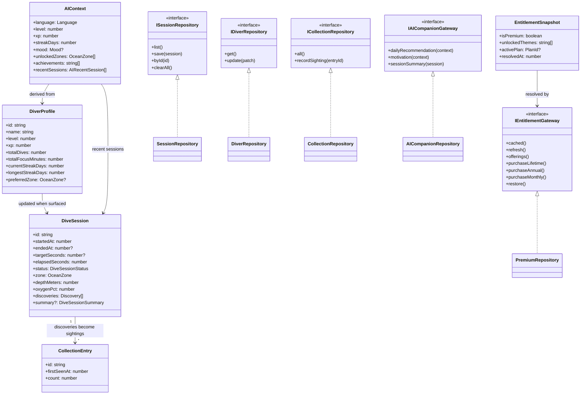

## 5. Persistence Map

```mermaid
flowchart TB
  subgraph MMKV["react-native-mmkv: deep-ocean.v1"]
    K1["onboarding.complete"]
    K2["diver.profile"]
    K3["discovery.collection"]
    K4["sessions.history"]
    K5["app.settings"]
    K6["app.theme"]
    K7["app.achievements"]
    K8["app.notifications.schedule"]
    K9["app.mood"]
    K10["app.ai.cache"]
    K11["app.premium.snapshot"]
    K12["app.premium.trial"]
    K13["app.premium.promo_codes"]
    K14["app.widget.snapshot"]
  end

  OnboardingScreen --> K1
  DiverRepository --> K2
  CollectionRepository --> K3
  SessionRepository --> K4
  settingsStore --> K5
  themeStore --> K6
  achievementStore --> K7
  NotificationRepository --> K8
  MoodRepository --> K9
  AICompanionRepository --> K10
  PremiumRepository --> K11
  PremiumRepository --> K12
  PremiumRepository --> K13
  WidgetSnapshot --> K14
```

## 6. Dive Session State Machine

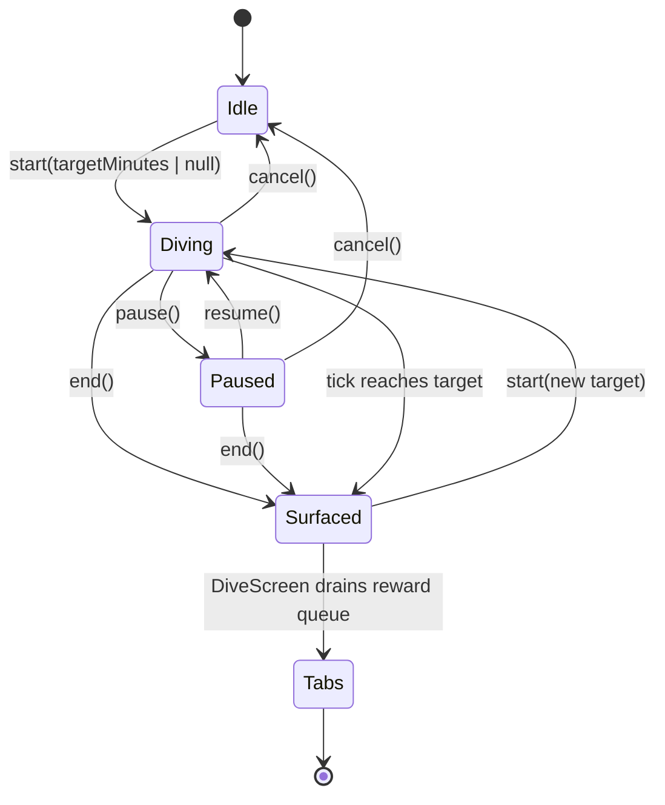

Important details:

- `start()` creates a seeded `DiveSession`, starts a 1 second interval, haptics,
  ambient audio, Live Activity, active/completion notifications.
- `tick()` advances elapsed focus seconds, maps minutes to depth, maps depth to
  zone, rolls deterministic discoveries, updates Live Activity.
- `pause()` freezes elapsed time, clears interval, clears active notifications,
  updates Live Activity.
- `resume()` accounts for paused duration, restarts interval, rearms notifications.
- `end()` persists the session, collection sightings, XP/level, streak, title
  achievements, then sets `pendingLevelUp` / `pendingAchievements`.
- `cancel()` discards the active session and returns to tabs without rewards.

## 7. Dive Session Sequence

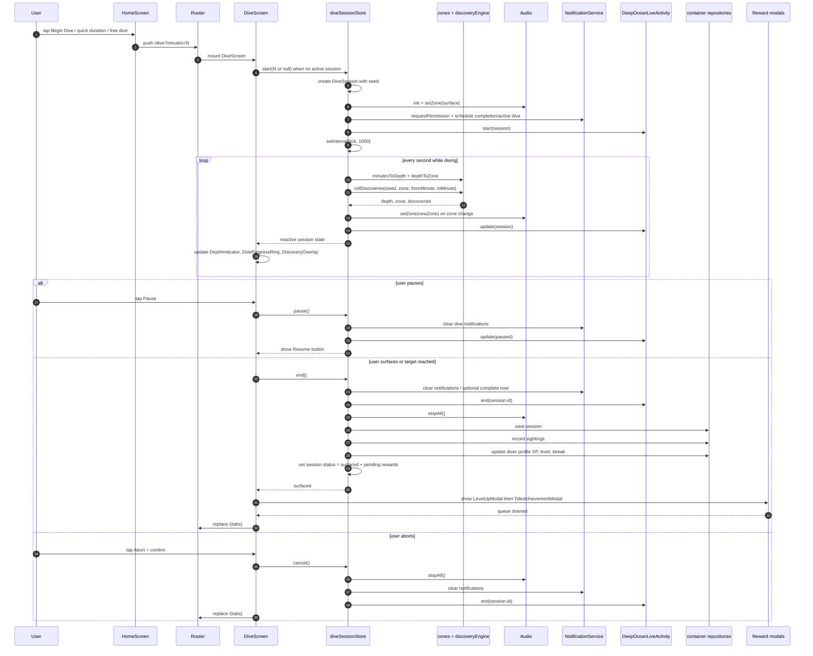

## 8. Discovery Presentation Flow

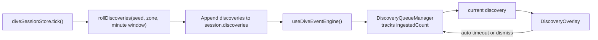

`DiscoveryQueueManager` is pure presentation buffering. The source of truth is
still `session.discoveries`, so no discovery is lost if several arrive in one
tick.

## 9. AI Companion Sequence

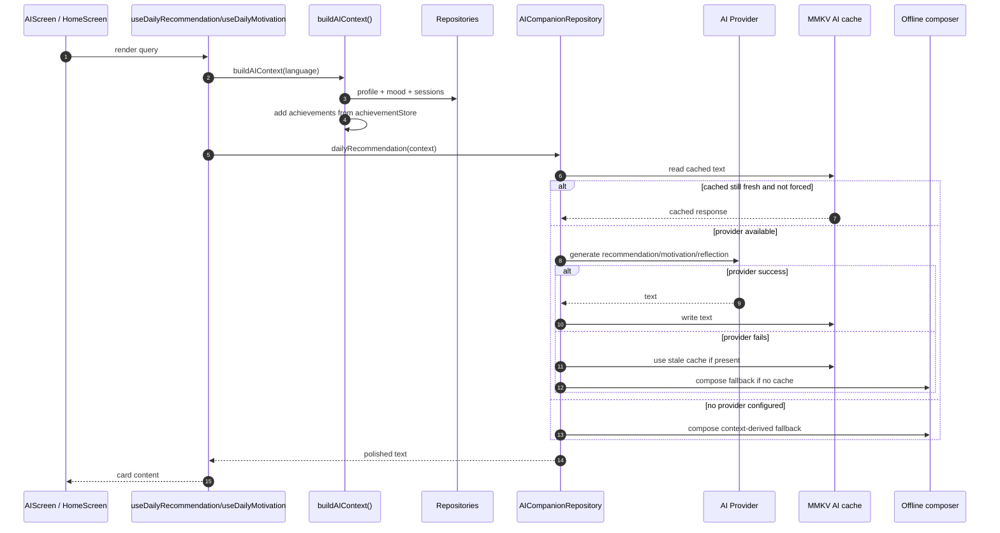

Manual refresh in `AIScreen` bypasses the daily query cadence with
`forceRefresh: true`, then writes the result back into React Query cache.

## 10. Premium / Paywall Sequence

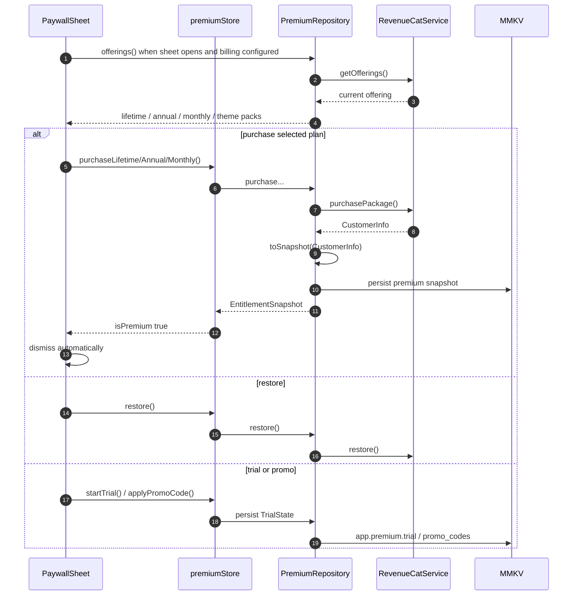

Premium state affects UI in three visible places:

- Tabs: free users see translucent default tab bar; premium users see `ProTabBar`.
- Collection and AI: locked story/insight surfaces open `PaywallSheet`.
- Profile: premium section, theme picker, debug premium switch in enabled dev mode.

## 11. Widget / Deep Link Sequence

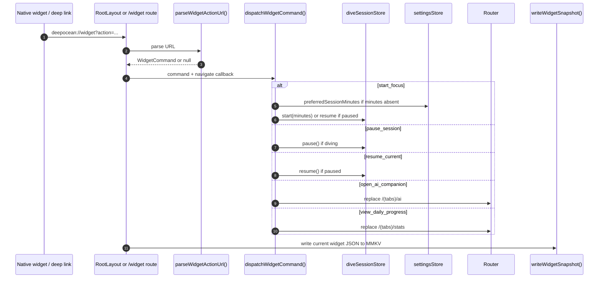

Primary widget action policy:

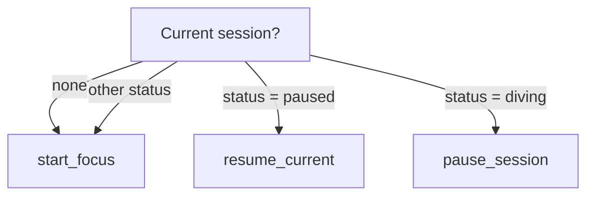

## 12. Notification Flow

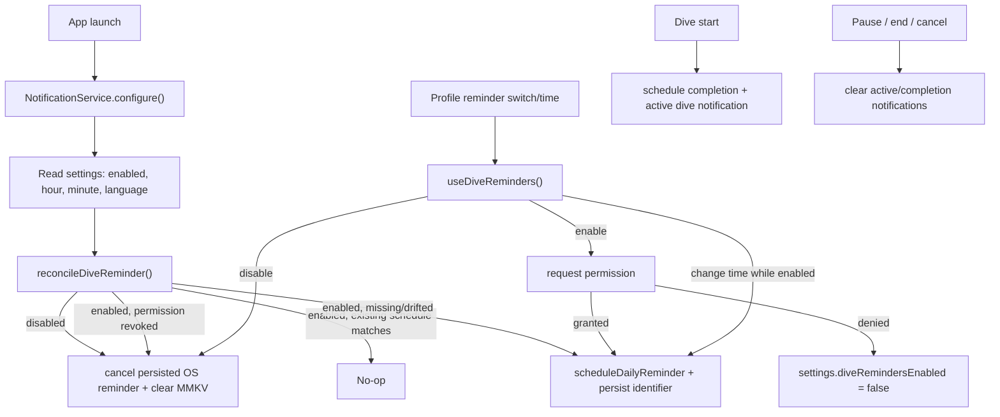

## 13. UI Step-By-Step

### 13.1 First Launch / Onboarding

1. App starts with splash held while fonts and bootstrap work complete.
2. `/` reads `onboarding.complete` from MMKV.
3. If false, app routes to `/onboarding`.
4. `OnboardingScreen` shows full-screen `ZoneBackground` + `UnderwaterCanvas`.
5. User swipes/paginates through zone chapters: surface, twilight, abyss,
   midnight, trench.
6. Dots jump between chapters; Back/Next move the `FlatList`.
7. Final slide shows the primary CTA.
8. CTA sets `onboarding.complete = true` and `router.replace("/(tabs)")`.

### 13.2 Tabs Shell

1. `TabsLayout` reads theme with `useTheme()`.
2. It reads `usePremium().isPremium`.
3. Free user gets the default translucent tab dock.
4. Premium user gets `ProTabBar`.
5. Tabs are lazy and frozen on blur: Home, Collection, Stats, AI, Profile.

### 13.3 Home Tab

1. Background: `ZoneBackground zone="midnight"` + `UnderwaterCanvas`.
2. Header shows time-based greeting, diver name, title/level rank.
3. While profile/session/AI data loads, skeleton components show.
4. Last dive recap appears if a previous session exists.
5. Main hero CTA starts preferred duration from settings.
6. Quick pills start 15, 25, 45, 60 minute dives.
7. Infinity pill starts unlimited dive on press.
8. Long press on infinity opens `FreeDiveModal` for custom minutes.
9. Zone progress strip reads unlocked zones from `achievementStore`.
10. Daily companion card reads AI recommendation.
11. KPI row shows streak, dives, level.
12. Streak milestone card appears when the user has an active streak.

### 13.4 Dive Screen

1. Route `/dive` mounts `DiveScreen`.
2. If no session exists, it calls `start(minutes)` using route params.
3. Full-screen UI renders current zone background and particles.
4. Top block shows `DepthIndicator`, discovery count, and `DiscoveryOverlay`.
5. Center shows `DiveProgressRing`.
6. Bottom controls show Pause/Resume, Surface, Abort.
7. Pause changes button text to Resume and freezes elapsed focus time.
8. Surface opens a confirmation sheet; confirm calls `end()`.
9. Abort opens a danger confirmation modal; confirm calls `cancel()`.
10. First-time zone entry shows `AchievementModal`.
11. After surfacing, reward queue shows `LevelUpModal` first, then
    `TitleAchievementModal`.
12. When reward queue is empty, route returns to `/(tabs)`.

### 13.5 Collection Tab

1. Background uses abyss zone and particles.
2. Header shows collection title and discovered count.
3. If nothing discovered yet, a dismissible guidance card appears.
4. Sticky rarity filters narrow the list.
5. `FlashList` renders creature/artifact rows from bestiary + collection entries.
6. Seen rows show actual item data and count; unseen rows remain locked.
7. Tapping a row opens `CreatureStorySheet`.
8. Free users see a Pro callout; locked Pro story content opens `PaywallSheet`.
9. Empty filter result shows a compact empty state card.

### 13.6 Stats Tab

1. Background uses abyss zone and particles.
2. App header introduces progress analytics.
3. KPI cards show max depth, total focus, dive count, level.
4. Weekly heatmap groups sessions by local day.
5. Recent expeditions list the latest sessions.
6. Empty state shows a CTA to start `/dive`.
7. Tapping a recent expedition routes to `/session/[id]`.

### 13.7 Session Detail

1. Header has back button and title.
2. If session is loading or missing, center state appears.
3. Body shows date/time, duration, focus minutes, XP, max depth.
4. Level card shows whether the dive caused a level-up.
5. `SessionTimeline` visualizes zone journey.
6. `DiscoveryTimeline` lists discoveries.
7. Share card calls the native share sheet with a generated summary.

### 13.8 AI Tab

1. Background uses midnight zone or last session zone for particles.
2. Header plus optional first-use guidance card.
3. Today card shows daily recommendation.
4. Ask Again forces fresh AI recommendation/motivation, then starts cooldown.
5. Nudge card shows daily motivation.
6. Last Expedition card summarizes the most recent session.
7. `ProInsights` either shows premium insights or opens paywall.
8. Mood grid persists selected mood and invalidates AI recommendation cache.

### 13.9 Profile Tab

1. Background uses trench zone and particles.
2. Header shows profile name and level.
3. Pencil opens inline name editor; check saves through `useUpdateDiver`.
4. XP card animates progress to next level.
5. Premium section opens paywall when not premium.
6. Appearance card opens theme picker, language picker, reduced motion switch.
7. Settings card controls haptics, ambient volume, discovery alerts, preferred duration.
8. Notifications card toggles dive reminders and opens time picker when enabled.
9. Account card can replay onboarding by deleting `onboarding.complete`.
10. Developer premium override appears only when the env flag is enabled.
11. About card shows app version and tagline.
12. Profile can show delayed level/title reward modals if XP overflow is detected.

## 14. Screen-To-State Cheat Sheet

| UI surface | Reads from | Writes/calls | Next visible effect |
| --- | --- | --- | --- |
| RootLayout | settings, premium cache, widget URL | notifications, premium hydrate, widget snapshot | Stack renders; deeplink may navigate |
| Home | diver profile, sessions, achievements, AI rec, settings | `router.push("/dive")` | Dive screen starts |
| Dive | `useDiveSession`, achievements, settings | start/pause/resume/end/cancel | live ring, discoveries, rewards, return tabs |
| Collection | collection, premium | story sheet, paywall | row details or purchase sheet |
| Stats | sessions, profile | route to session detail | detail page |
| AI | sessions, mood, premium, AI cache | set mood, force refresh, paywall | new guidance / locked insight |
| Profile | profile, settings, theme, premium, reminders | update settings/profile/theme/reminder/premium | sheets, switches, persisted preferences |
| Widget | settings, dive session, premium | dispatch start/pause/resume/navigate | snapshot JSON + navigation/action |

## 15. Where To Change Things

- Add/change a route: `app/`, then keep heavy logic in `src/screens` or `src/features`.
- Change focus/dive behavior: `src/stores/diveSessionStore.ts`.
- Change depth/zone timing: `src/features/ocean/zones.ts`.
- Change discoveries: `src/features/ocean/bestiary*` and `src/features/ocean/discoveryEngine.ts`.
- Change post-dive XP/streak/title logic: `src/features/diver/*` and `diveSessionStore.end()`.
- Change persistent data contracts: `src/domain/entities.ts`, `src/domain/repositories.ts`, concrete repos in `src/data/repositories`.
- Change paywall behavior: `src/design-system/scenes/PaywallSheet.tsx`, `src/stores/premiumStore.ts`, `src/data/repositories/PremiumRepository.ts`.
- Change widget behavior: `src/features/widget/*`, `app/_layout.tsx`, `app/widget.tsx`.
- Change reminder behavior: `src/features/notifications/*`, `src/core/notifications/NotificationService.ts`.
